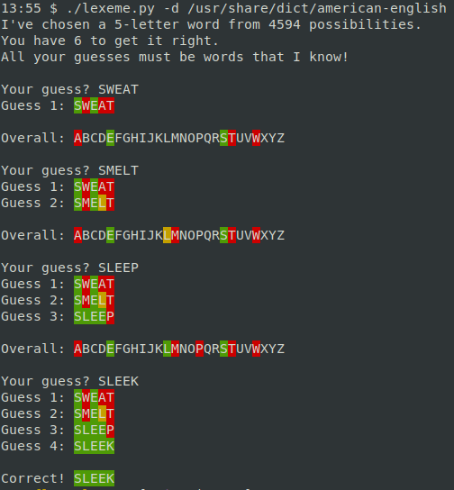
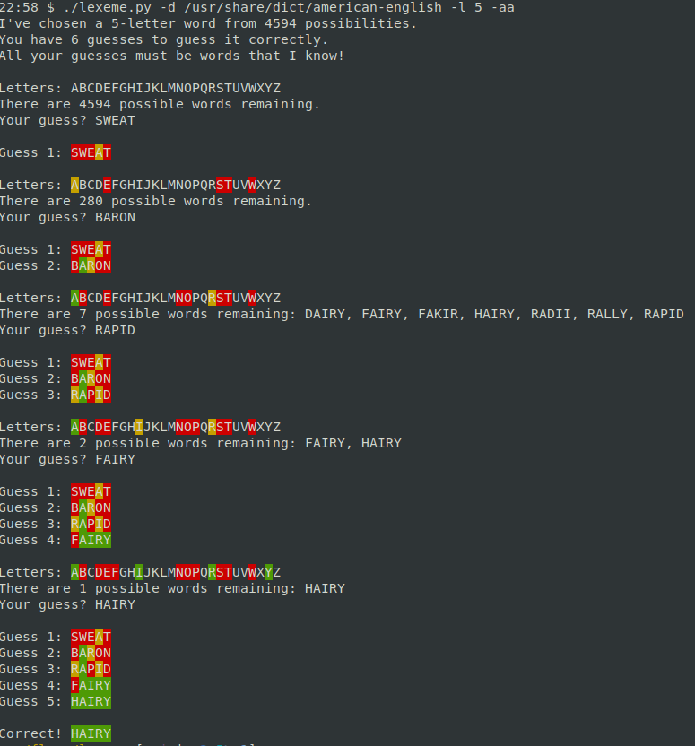

# Lexeme

[](https://www.gnu.org/licenses/gpl-3.0)
[](https://github.com/dlenski/lexeme/actions/workflows/build_and_test.yml)

# What is this?

Python program to play a word-guessing game like
[Wordle](https://www.powerlanguage.co.uk/wordle), but…

- ***More addictive*** because you can play it over and over and over, not just once a day.
- Option for varying the word length (`-l`, `--length`) or number of guesses (`-g`, `--guesses`)
- Option to allow guesses that aren't known words (`-n`, `--nonsense`)
- Option to do guess-by-guess analysis, showing how many words you eliminate after each guess (`-a`, `--analysis`)
- Option to show time taken after every guess (`-t`, `--timer`)
- A bunch of unit tests to verify the logic
- Beautiful command-line text interface (😜)

## Running it

### Installation

Requires Python 3.x, the [`colorama` module](https://pypi.org/project/colorama)
for printing colored letters, and a file containing a list of possible
words.

Install with `pip3 install https://github.com/dlenski/lexeme/archive/main.zip`, then play the game with the command `lexeme`.

### Wordlists

The default wordlist is taken from `/usr/share/dict/words`, which
should exist on any desktop Unix system.

#### Collins Scrabble Word Lists

The [Collins Scrabble Word Lists](https://boardgames.stackexchange.com/questions/38366/latest-collins-scrabble-words-list-in-text-file)
seem to work nicely! The 2019 edition (CSW2019) contains 12,972 five-letter words,
which are precisely the same as [the valid guesses in Wordle itself](#wordle-word-lists).

#### Word lists for French, Spanish, and German

The project [lorenbrichter/Words](https://github.com/lorenbrichter/Words/tree/master/Words)
contains high-quality French, Spanish, and German wordlists used for other
word games.

Diacritics have been removed (e.g. `français` → `francais` and `hablé` → `hable`),
and as far as I can see, all of the possible inflected verb forms are included
for French and Spanish. Should be very playable with Lexeme!

#### Wordle word lists

The wordlists used by Wordle itself are a bit unusual: Wordle has a short
list of words as possible answers (2,315 words), but a much longer list of
additional words as allowed guesses (10,657 additional words). They can be
extracted with, say, these horrible cURL+Perl one-liners:

```sh
curl https://www.powerlanguage.co.uk/wordle/main.db1931a8.js |
    perl -ne 'print join("\n", ($1=~/\w+/g)) . "\n" if /Aa=(\[[^]]+\])/' > wordle_possible_answers.txt
curl https://www.powerlanguage.co.uk/wordle/main.db1931a8.js |
    perl -ne 'print join("\n", ($1=~/\w+/g)) . "\n" if /La=(\[[^]]+\])/' | cat wordle_possible_answers.txt - > wordle_allowed_guesses.txt
```

The combined 12,972 words allowed as guesses in Wordle **precisely
match** the 12,972 five-letter words in CSW2019 (the 2019 edition of
the Collins Scrabble Word List).


### Options

```
usage: lexeme [-h] [-d DICT] [-g GUESSES] [-l LENGTH] [-n] [-a]

optional arguments:
  -h, --help            show this help message and exit
  -d DICT, --dict DICT  Wordlist to use, either an absolute path or a path
                        relative to /usr/share/dict. Default
                        /usr/share/dict/words.
  -g GUESSES, --guesses GUESSES
                        Maximum number of guesses to allow
  -l LENGTH, --length LENGTH
                        Length of word to guess
  -n, --nonsense        Allow nonsense guesses. (Default is to only allow
                        known words.)
  -a, --analyzer        Analyze remaining possible words, and show their
                        number after each guess. If repeated (cheater mode!),
                        it will show you all the remaining possible words when
                        there are fewer than 100
  -t, --timer           Show time taken after every guess.
  -D, --strip-diacritics
                        EXPERIMENTAL: Strip diacritics from words (should
                        allow playing with Spanish/French wordlists)
```

## Screenshots

Example of gameplay, with analyzer (`-a`) and timer (`-t) enabled,
showing you the _number_ of possible remaining words, and the time taken
for each guess:



Example of cheater mode (`-aa`), show you all of the possible remaining words
after each guess, as long as there are ≤100 of them:



# Inspiration

- [Wordle](https://www.powerlanguage.co.uk/wordle), of course
- [@jsha](https://github.com/jsha)'s brilliant [Wordlyze](https://wordlyze.crud.net) ([source](https://github.com/jsha/learnrust/blob/master/wordle/src/main.rs) for the analyzer mode
- [The subtle handling of repeated letters](https://twitter.com/moxfyre/status/1477320939520020484) inspired the unit tests
