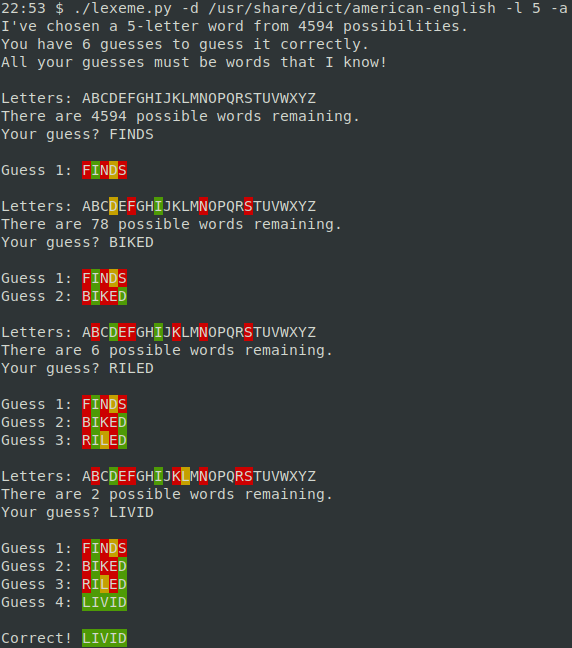

# What is this?

Python program to play a word-guessing game like
[Wordle](https://www.powerlanguage.co.uk/wordle).

## Requirements

Python 3.x, the [`colorama` module](https://pypi.org/project/colorama),
and a list of possible words (by default in `/usr/share/dict/words`).

## Options

```
$ ./lexeme.py --help
usage: lexeme.py [-h] [-d DICT] [-g GUESSES] [-l LENGTH] [-n]

optional arguments:
  -h, --help            show this help message and exit
  -d DICT, --dict DICT  Wordlist to use, either an absolute path or a path
                        relative to /usr/share/dict. Default
                        /usr/share/dict/words.
  -g GUESSES, --guesses GUESSES
                        Maximum number of guesses to allow
  -l LENGTH, --length LENGTH
                        Length of word to guess
  -n, --nonsense        Allow nonsense guesses. (Default is to only allow
                        known words.)
  -a, --analyzer        Analyze remaining possible words, and show their
                        number after each guess. If repeated (cheater mode!),
                        it will show you all the remaining possible words when
                        there are fewer than 100
```

## Screenshots

Example of gameplay:


Example of analyzer mode (`-a`), showing you the _number_ of possible remaining words
after each guess:



Example of cheater mode (`-aa`), show you all of the possible remaining words
after each guess, as long as there are ≤100 of them:


